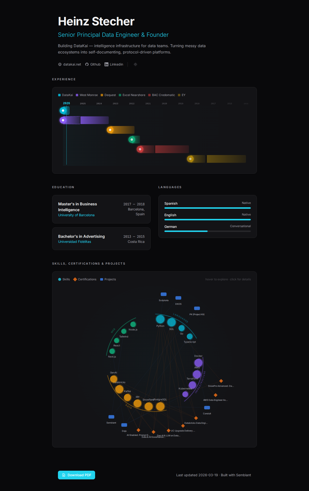
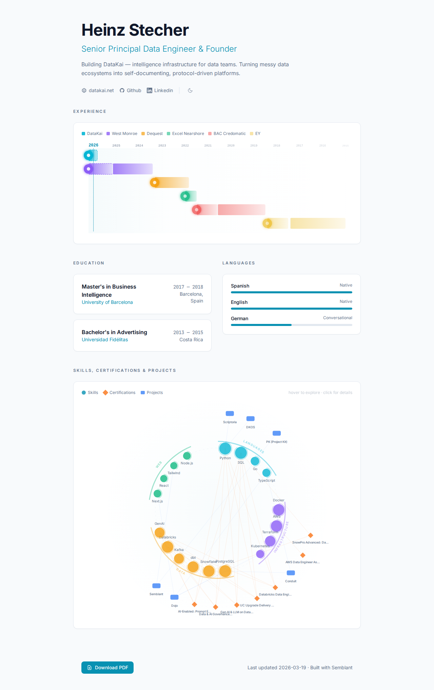
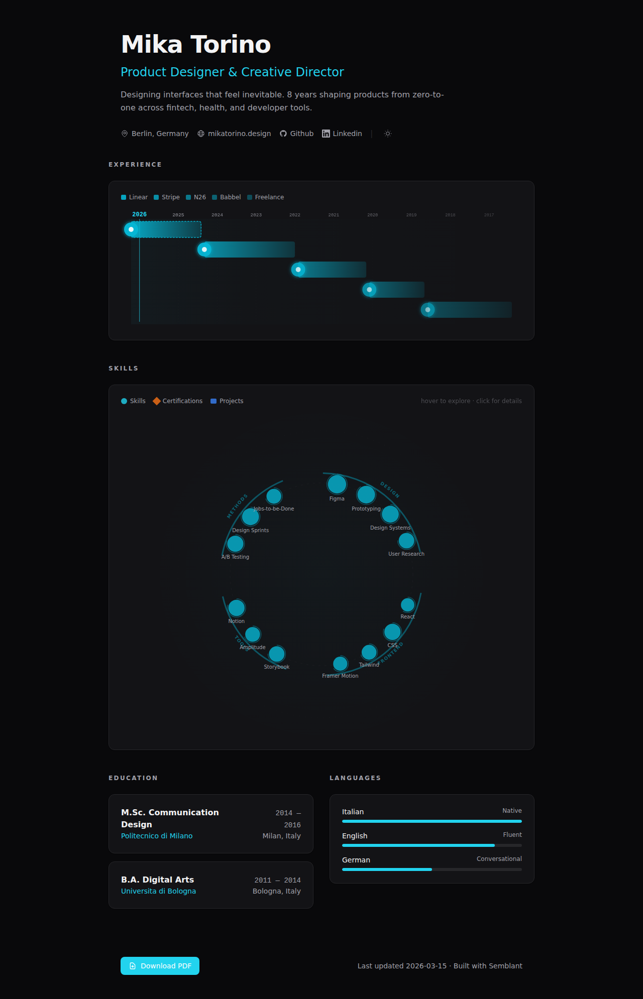
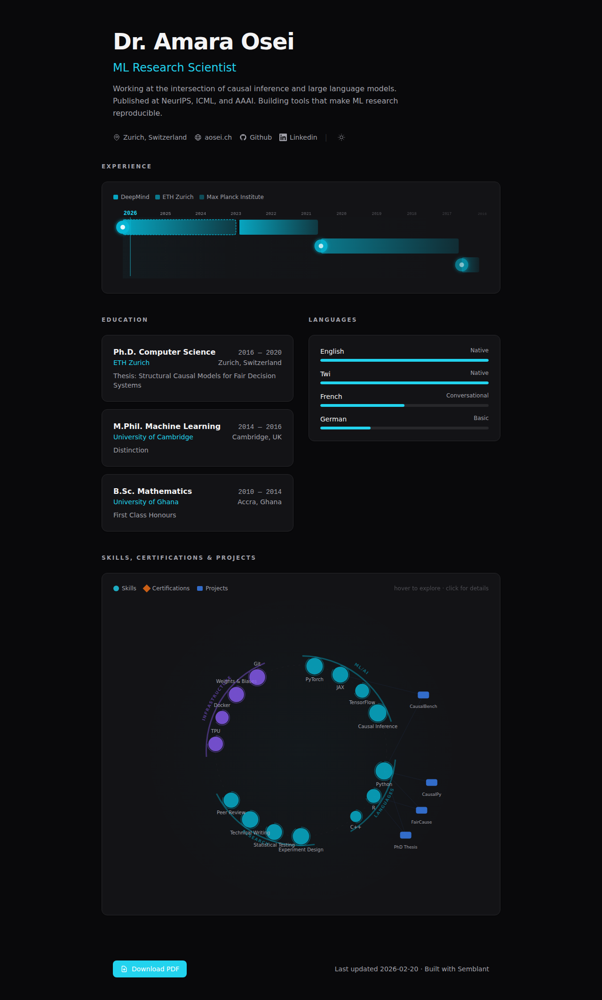
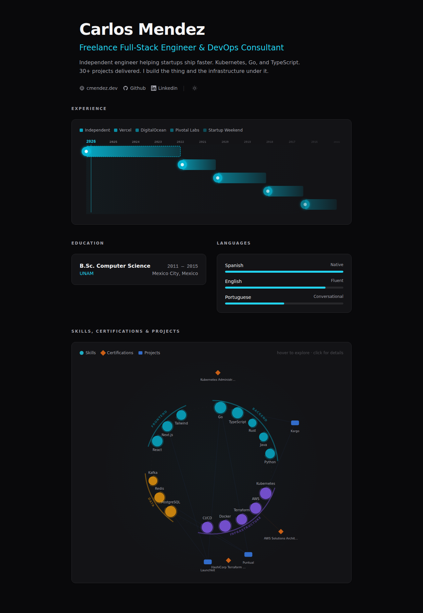

# Semblant

Resume-as-code. Structured YAML data, Go API server, Astro frontend with D3 visualizations, and PDF export — in a single binary.

<p align="center">
  <a href="https://semblant.ai">Website</a> · <a href="https://cv.datakai.net">Live Demo</a> · <a href="#quickstart">Quickstart</a>
</p>

<p align="center">
  <picture>
    <source media="(prefers-color-scheme: dark)" srcset="docs/screenshots/full-dark.png">
    <source media="(prefers-color-scheme: light)" srcset="docs/screenshots/full-light.png">
    
  </picture>
</p>

## What you get

- **Website** — responsive Astro site with dark/light mode, driven entirely by your YAML
- **PDF** — hyperlinked, multi-page PDF generated server-side (no browser, no Puppeteer)
- **API** — JSON endpoint for your resume data with privacy filtering
- **Comet Timeline** — D3 interactive experience visualization with company grouping, promotions, and recency fading
- **Skills Ecosystem** — radial network graph connecting skills, certifications, and projects

<details>
<summary>Light mode</summary>

</details>

## Examples

Same engine, different careers. Each is just a YAML file — see [`examples/`](examples/) for the source.

<table>
<tr>
<td align="center"><strong>Product Designer</strong><br><sub>5 companies · design tools & methods</sub></td>
<td align="center"><strong>ML Researcher</strong><br><sub>PhD + DeepMind · publications as projects</sub></td>
<td align="center"><strong>Freelance Engineer</strong><br><sub>consulting + startups · deep infra stack</sub></td>
</tr>
<tr>
<td></td>
<td></td>
<td></td>
</tr>
</table>

> Try one: `cp examples/designer.yaml data/resume.yaml && make build && ./bin/semblant`

## Quickstart

```bash
# 1. Create your resume
cp data/resume.example.yaml data/resume.yaml
# Edit data/resume.yaml with your info

# 2. Install frontend dependencies
cd web && npm install && cd ..

# 3. Build and run
make build
./bin/semblant
# → http://localhost:5173
```

## Resume schema

Your resume lives in `data/resume.yaml`. See [`data/resume.example.yaml`](data/resume.example.yaml) for the full schema with comments.

```yaml
personal:
  name: "Jane Doe"
  title: "Senior Software Engineer"
  bio: "..."
  website: "https://janedoe.dev"
  links:
    - platform: github
      url: "https://github.com/janedoe"
  contact:
    - type: email
      value: "jane@example.com"
      visibility: private  # stripped from public API

experience:
  - company: "Acme Corp"
    url: "https://acme.example.com"  # hyperlinked in PDF
    role: "Senior Software Engineer"
    start: "2023-01"
    end: null  # null = current
    highlights:
      - "Reduced p99 latency by 40%"
    technologies: [Go, PostgreSQL, Kubernetes]

skills:
  - category: "Languages"
    items:
      - name: "Go"
        level: 85  # 0-100, drives node size in ecosystem graph
      - name: "Python"
        level: 80
# ... education, certifications, languages, projects

layout:
  accent: "#8b5cf6"  # custom accent color (default: teal)
  sections:          # which sections to render, in order
    - experience
    - skills
    - education
    # omit a section to hide it, reorder to rearrange
```

### Layout

The `layout` block is optional. If omitted, all sections render in the default order with the default teal accent.

- **`accent`** — hex color applied to the title, links, buttons, tags, section lines, PDF highlights, and the Download button. One value themes everything.
- **`sections`** — ordered list of sections to render. Available: `experience`, `education`, `languages`, `skills`, `certifications`, `projects`. Omit a section to hide it. Reorder to rearrange. The skills/certifications/projects ecosystem graph adapts — if you remove `certifications`, the graph only shows skills and projects.

### Privacy

Fields with `visibility: private` are stripped from the public `/api/resume` endpoint and the frontend. The PDF includes all fields (it's behind auth).

## Configuration

All configuration via environment variables:

| Variable | Default | Description |
|---|---|---|
| `SEMBLANT_PORT` | `5173` | Server port |
| `SEMBLANT_RESUME_PATH` | `data/resume.yaml` | Path to resume YAML |
| `SEMBLANT_WEB_DIR` | `web/dist` | Path to built frontend |
| `SEMBLANT_PDF_AUTH_SECRET` | *(empty)* | Bearer token for PDF endpoint. If empty, PDF returns 401 |
| `SEMBLANT_CORS_ORIGINS` | `*` | Comma-separated allowed origins. Set to your domain in production |

## API

| Endpoint | Auth | Description |
|---|---|---|
| `GET /health` | No | `{"status":"ok"}` |
| `GET /api/resume` | No | Public resume JSON (private fields stripped) |
| `GET /api/resume?full=true` | Bearer | Full resume including private fields |
| `GET /api/resume/pdf` | Bearer | Download PDF |

## Development

```bash
# Run Go server + Astro dev server concurrently
make dev

# Or separately:
make go-run      # Go server only
make web-dev     # Astro dev server only

# Build
make build       # Builds both frontend and Go binary

# Test
make test        # Go tests + Playwright e2e
make test-go     # Go tests only
```

### Project structure

```
cmd/semblant/         Entry point
internal/
  api/                HTTP handlers, middleware, routing
  config/             Environment-based configuration
  pdf/                PDF renderer (theme, helpers, per-section methods)
  resume/             Schema, YAML loader, privacy filtering
data/
  resume.yaml         Your resume data
  resume.example.yaml Schema reference with placeholder data
web/
  src/
    pages/            Astro pages
    components/       Static Astro components
    islands/          Interactive React + D3 islands
    lib/              Shared constants, types, utilities
```

## Docker

```bash
docker build -t semblant .
docker run -p 8080:8080 \
  -e SEMBLANT_PDF_AUTH_SECRET=your-secret \
  -e SEMBLANT_CORS_ORIGINS=https://your-domain.com \
  semblant
```

The image runs as non-root (UID 1001), with a read-only root filesystem.

## Security

Semblant includes production-grade security defaults:

- **Auth**: Constant-time token comparison (no timing attacks)
- **Rate limiting**: Per-IP limits on all endpoints (5 req/min on PDF)
- **Security headers**: HSTS, CSP, X-Frame-Options, X-Content-Type-Options, Referrer-Policy
- **CORS**: Configurable origin allowlist (defaults to `*` for development)
- **Privacy filtering**: Private fields never leak through the public API
- **Container**: Non-root user, read-only filesystem, all capabilities dropped

## License

Apache License 2.0. See [LICENSE](LICENSE).
